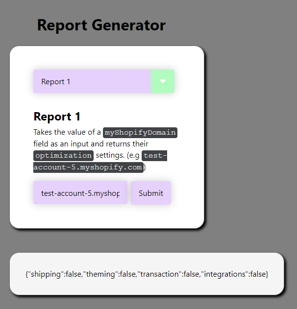
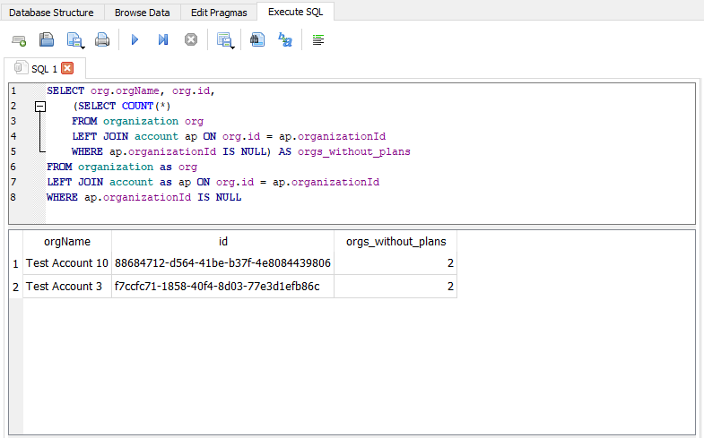
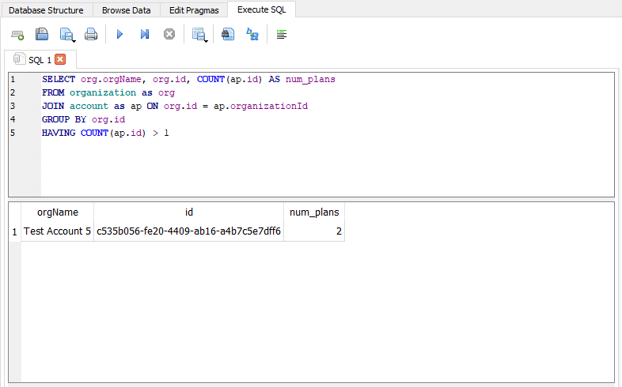
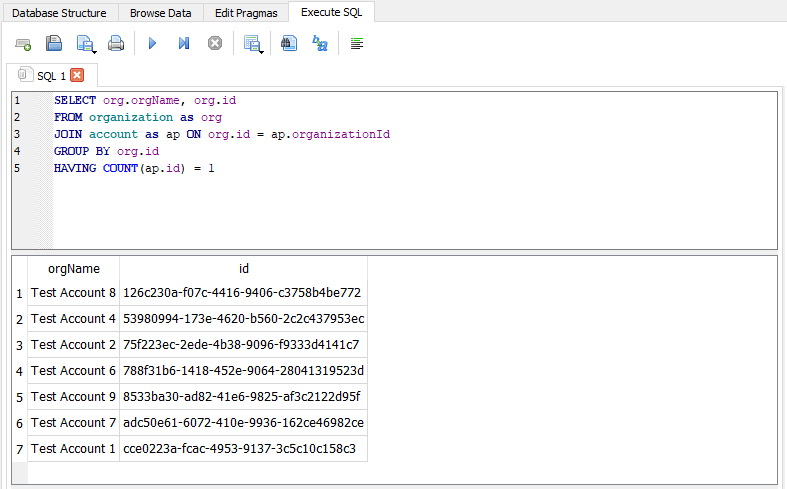
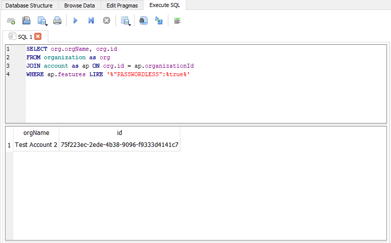

## Usage

- Visit https://tsu-haoliu.github.io/support_engineer_homework
- Select a report option from the dropdown menu
- Report #1: Enter `myShopifyDomain` in input field, then click submit
- Report #2: Click generate report button to show all organizations sorted by oldest to newest
- Report #3: Click generate report button to return the list of organizations whose status is cancelled
- Report #4: Enter an `orgName` in input field, then click submit to view the organization's record in JSON format.




## SQL Questions

### SQL #1: How many organizations do not have account plans?
```sql
SELECT org.orgName, org.id,
	(SELECT COUNT(*) 
	FROM organization org 
	LEFT JOIN account ap ON org.id = ap.organizationId
	WHERE ap.organizationId IS NULL) AS orgs_without_plans
FROM organization as org
LEFT JOIN account as ap ON org.id = ap.organizationId
WHERE ap.organizationId IS NULL
```



### SQL #2: How many organizations have more than one account plan?

```sql
SELECT org.orgName, org.id, COUNT(ap.id) AS num_plans 
FROM organization as org
JOIN account as ap ON org.id = ap.organizationId
GROUP BY org.id
HAVING COUNT(ap.id) > 1
```




### SQL #3: List all organizations that have only one account plan.
```sql
SELECT org.orgName, org.id
FROM organization as org
JOIN account as ap ON org.id = ap.organizationId
GROUP BY org.id
HAVING COUNT(ap.id) = 1
```



### SQL #4: List all organizations that have the PASSWORDLESS feature set to true.
```sql
SELECT org.orgName, org.id
FROM organization as org
JOIN account as ap ON org.id = ap.organizationId
WHERE ap.features LIKE '%"PASSWORDLESS":%true%'
```




## Support Engineer Homework

1. Fork this repository.
2. Add `smartrr-hello` as a collaborator to your repository.
3. Use the [test data](https://docs.google.com/spreadsheets/d/1uyDXhb3T3-LVywTvpH1ixWbz6if7vUaUQC6YHcNm-wY/edit?usp=sharing) to answer the questions below. The test data is in CSV form in two tabs. Each tab represents a table:
   - organization
   - account 
4. Add all SQL and JavaScript files to your fork.
5. Write a README explaining how to run your application.
6. Push up your submission and let us know where to find it.

## Questions:

Use JS and SQL to answer the following questions.

**JavaScript**
- Write a JavaScript application. The app can be a CLI or web-based app. It should provide a user with the options to run four reports:
  1. Takes the value of a `myShopifyDomain` field as an input and returns their `optimization` settings.
  2. Loops through all organizations and shows the date they were created (DD/MM/YYYY), their `status`, and `planName` sorted by oldest to newest.
  3. Returns the list of organizations whose status is cancelled.
  4. Takes the value of an `orgName` and returns the organization record in JSON format.

**SQL**
- Write SQL queries to return:
  - How many organizations do not have account plans? 
  - How many organizations have more than one account plan?
  - List all organizations that have only one account plan.
  - List all organizations that have the PASSWORDLESS feature set to true.

